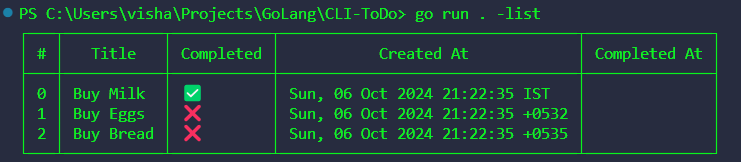

# Go Todo CLI Application

This is a simple command-line Todo application written in Go. It allows you to manage a list of todos, including adding, deleting, editing, toggling, and listing todos. The app uses a file-based storage system to persist the todos.

## Preview

Here’s a preview of the Todo CLI app in action:



## Features

- Add a new todo.
- Delete a todo by index.
- Edit a todo by index.
- Toggle a todo's completion status by index.
- List all todos.
- Display help information.

## Prerequisites

- [Go](https://golang.org/dl/) 1.18 or higher

## Installation

1. Clone the repository:

```bash
git clone https://github.com/yourusername/go-todo-cli.git
cd go-todo-cli
```

2. Run the project:

```bash
go run . -[command] [arguments]
```

## Usage
Add a new todo:
```bash
go run . -add "Buy groceries"
```
List all todos:
```bash
go run . -list
```
Delete a todo by index:
```bash
go run . -delete 1
```
Edit a todo by index:
```bash
go run . -edit 1 "Buy milk"
```
Toggle a todo's completion status by index:
```bash
go run . -toggle 1
```
Display help information:
```bash
go run . -help
```
